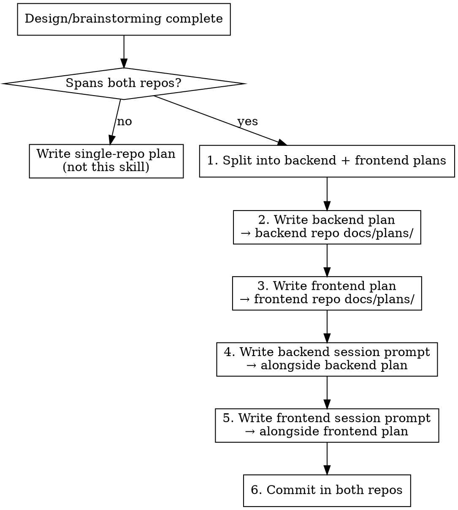

# Cross-Repo Planning

## Overview

When an implementation spans both backend and frontend repos, **always split into two separate plans** — one per repo. Each plan must be a standalone prompt that a fresh agent with zero prior context can execute.

**Backend plan always executes first** — the API contract must exist before the frontend consumes it.

## When to Use

- Design session produced changes needed in both backend and frontend
- You're about to write an implementation plan and the scope touches API schemas, DB models, or codegen (backend) AND types, stores, API layer, or UI (frontend)
- User says "plan this feature" and it clearly crosses the repo boundary

**When NOT to use:**
- Change is frontend-only (no backend API changes)
- Change is backend-only (no frontend consumers yet)
- You're executing an existing plan (use `superpowers:executing-plans` instead)

## Repo Paths

| Repo | Path | Plans directory |
|------|------|-----------------|
| Backend | `/Users/evgesha/Documents/Projects/mediancode/repos/median-code-backend` | `docs/plans/` |
| Frontend | `/Users/evgesha/Documents/Projects/mediancode/repos/median-code-frontend` | `docs/plans/` |

## Process



### Step 1: Split the plan by repo

Separate all tasks into two groups:
- **Backend**: DB models, migrations, API schemas, service layer, codegen, templates, backend tests
- **Frontend**: TypeScript types, API client layer, stores, UI components, frontend tests (unit + E2E)

### Step 2: Write the backend plan

Save to: `<backend-repo>/docs/plans/YYYY-MM-DD-<feature-name>-impl.md`

Required sections:
- Header with `> **For Codex:** REQUIRED SUB-SKILL: Use superpowers:executing-plans`
- **Goal**: One sentence
- **Architecture**: How the pieces fit together
- **Tech Stack**: Python, FastAPI, SQLAlchemy, Pydantic, Alembic, pytest, etc.
- **Prerequisite**: None (backend goes first) or link to design doc
- **Tasks**: Numbered, each with files to modify, step-by-step instructions, test command, commit command
- **Final Verification**: Full test suite task
- **Expected API Contract**: JSON examples of request/response after implementation

### Step 3: Write the frontend plan

Save to: `<frontend-repo>/docs/plans/YYYY-MM-DD-<feature-name>-impl.md`

Required sections:
- Same structure as backend plan
- **Prerequisite**: "Backend must be deployed with the matching API changes first. The backend plan is at `<path>`."
- **Expected API Contract**: Must match backend plan exactly (copy it)

### Step 4: Write session prompts

For each plan, write a companion prompt file alongside it.

**Backend prompt**: `<backend-repo>/docs/plans/YYYY-MM-DD-<feature-name>-backend-prompt.md`
**Frontend prompt**: `<frontend-repo>/docs/plans/YYYY-MM-DD-<feature-name>-frontend-prompt.md`

#### Prompt template

```markdown
# Session Prompt: <Feature Name> — <Backend|Frontend>

## Context

You are implementing <brief description>. The full implementation plan is at:

`<absolute path to the plan file>`

Read the plan before doing anything.

## Instructions

Execute the plan task-by-task following these rules:

1. Read the full plan first
2. Execute task-by-task in order — do NOT skip ahead
3. Run tests after each task — fix failures before moving on
4. Commit after each task with the commit message specified in the plan
5. Zero failures is the only acceptable outcome
6. If a test fails, fix it before proceeding — do not accumulate debt

**REQUIRED SUB-SKILL:** Use superpowers:executing-plans to implement this plan.

## Scope

- **Tasks**: <N> tasks across <M> parts
- **Parts**: <list the part names>
- **Estimated files**: <count> files to create/modify

## Key constraints

<Any repo-specific constraints — e.g., test commands, framework versions, validation rules>
```

### Step 5: Commit in both repos

Commit plan + prompt in each repo separately:

```bash
# Backend
cd <backend-repo>
git add docs/plans/YYYY-MM-DD-<feature>-impl.md docs/plans/YYYY-MM-DD-<feature>-backend-prompt.md
git commit -m "docs(plans): add implementation plan for <feature>"

# Frontend
cd <frontend-repo>
git add docs/plans/YYYY-MM-DD-<feature>-impl.md docs/plans/YYYY-MM-DD-<feature>-frontend-prompt.md
git commit -m "docs(plans): add implementation plan for <feature>"
```

## Plan Quality Checklist

Each plan (backend and frontend) must pass ALL of these:

- [ ] **Self-contained**: A fresh agent with zero context can execute it
- [ ] **Task-by-task**: Every task has files, steps, test command, commit command
- [ ] **No cross-references to the other plan** for execution (only for prerequisite acknowledgment)
- [ ] **API contract section** matches between both plans exactly
- [ ] **Test commands** are repo-appropriate (pytest for backend, vitest/playwright for frontend)
- [ ] **Commit messages** follow the repo's conventional commit standard
- [ ] **Line number hints** included where helpful (e.g., "~line 175, Field interface")
- [ ] **Code snippets** show exact before/after for non-trivial changes

## Common Mistakes

| Mistake | Fix |
|---------|-----|
| Writing a single combined plan | Always split — two repos = two plans |
| Frontend plan doesn't mention backend prerequisite | Add explicit prerequisite with backend plan path |
| API contract sections don't match | Copy the contract from backend plan to frontend plan |
| Prompt doesn't include task count | Count tasks and parts, include in Scope section |
| Plan assumes context from design session | Plan must stand alone — include architecture summary |
| Forgetting to write prompts | Prompts are mandatory — write them immediately after plans |
| Frontend plan says "deploy backend first" without path | Include the exact file path to the backend plan |

## Red Flags — STOP

If you catch yourself doing any of these, stop and correct:

- Writing implementation steps that belong in the other repo's plan
- Referencing "the design session" without summarizing the relevant decision
- Skipping the session prompt files ("I'll write those later")
- Making the frontend plan depend on reading the backend plan for execution steps
- Using relative paths instead of absolute paths in prompts
